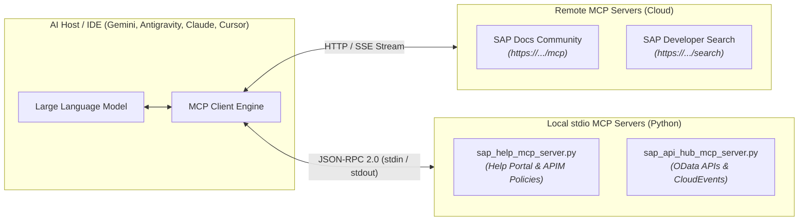
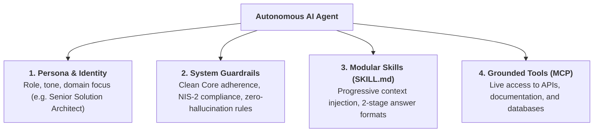

# 🎓 SAP MCP Agent Starter Kit

[](https://opensource.org/licenses/MIT)
[](https://www.python.org/)
[](https://modelcontextprotocol.io/)

> **A comprehensive, hands-on starter kit for students, educators, and software engineers to learn how to build Model Context Protocol (MCP) servers from scratch in Python and define grounded AI Agents with specialized Skills.**

---

## 🧭 Table of Contents

1. [Architectural Overview: What is MCP?](#1-architectural-overview-what-is-mcp)
2. [The Two Flavors of MCP: Remote URL vs. Local stdio](#2-the-two-flavors-of-mcp-remote-url-vs-local-stdio)
3. [Deep Dive: Building Zero-Dependency Python MCP Servers](#3-deep-dive-building-zero-dependency-python-mcp-servers)
4. [Defining Autonomous Agents & Skills](#4-defining-autonomous-agents--skills)
5. [Cross-Platform Compatibility Matrix](#5-cross-platform-compatibility-matrix)
6. [Hands-On Student Tutorial (Step-by-Step)](#6-hands-on-student-tutorial-step-by-step)
7. [Automated Testing & Verification](#7-automated-testing--verification)

---

## 1. Architectural Overview: What is MCP?

Large Language Models (LLMs) traditionally operate as isolated reasoning engines: they possess vast general knowledge but cannot directly inspect enterprise APIs, query databases, or execute secure local scripts.

The **Model Context Protocol (MCP)**, open-sourced by Anthropic and adopted across the AI industry (Google Antigravity, Claude Code, Cursor, Windsurf), acts as an open, vendor-neutral standard—the "USB-C standard for AI":



---

## 2. The Two Flavors of MCP: Remote URL vs. Local stdio

When configuring AI clients, you will encounter two primary delivery models:

### Type A: Remote-Hosted MCP Servers (Pure URLs)
* **Examples:**
  * `sap-docs-community`: `https://mcp-sap-docs.marianzeis.de/mcp`
  * `sap-developers-search`: `https://developers.sap.com/mcp/search`
* **How it works:**
  The server runs remotely in the cloud. The AI client connects via **Server-Sent Events (SSE)** or HTTP streaming.
* **Benefits:** Zero installation, no local dependencies, always up-to-date.
* **Configuration:**
  ```json
  "sap-docs-community": {
    "serverUrl": "https://mcp-sap-docs.marianzeis.de/mcp",
    "description": "Semantic search across SAP community and official documentation."
  }
  ```

### Type B: Local Executable Servers (stdio Subprocesses)
* **Examples:**
  * `sap-help-portal-local`: `scripts/sap_help_mcp_server.py`
  * `sap-api-hub-local`: `scripts/sap_api_hub_mcp_server.py`
* **How it works:**
  The AI IDE spawns your script as a local child process. The IDE communicates with your script via standard streams: sending requests over **Standard Input (`stdin`)** and receiving responses over **Standard Output (`stdout`)**.
* **Benefits:** 100% offline capable (flight mode), zero latency, access to local files and corporate firewalls.
* **Configuration:**
  ```json
  "sap-help-portal-local": {
    "command": "python3",
    "args": ["scripts/sap_help_mcp_server.py"],
    "description": "Local APIM XML policy and Help Portal catalog."
  }
  ```

---

## 3. Deep Dive: Building Zero-Dependency Python MCP Servers

While frameworks like `FastMCP` exist, building an MCP server using **pure Python standard library** (`json`, `sys`, `urllib`) provides fundamental insights into how AI protocols actually operate.

### The JSON-RPC 2.0 Protocol Lifecycle

Every stdio MCP server processes JSON-RPC messages arriving line-by-line via `stdin`:

#### 1. Handshake (`initialize`)
The client negotiates protocol versions and capabilities:
```json
// Client -> Server
{"jsonrpc": "2.0", "id": 1, "method": "initialize"}

// Server -> Client
{
  "jsonrpc": "2.0",
  "id": 1,
  "result": {
    "protocolVersion": "2024-11-05",
    "capabilities": {"tools": {}},
    "serverInfo": {"name": "student-sap-help-portal", "version": "1.0.0"}
  }
}
```

#### 2. Exposing Capabilities (`tools/list`)
The client retrieves the registered tools and their JSON schemas:
```json
// Client -> Server
{"jsonrpc": "2.0", "id": 2, "method": "tools/list"}

// Server -> Client
{
  "jsonrpc": "2.0",
  "id": 2,
  "result": {
    "tools": [
      {
        "name": "sap_help_get_policy",
        "description": "Returns official XML configuration template for an APIM policy.",
        "inputSchema": {
          "type": "object",
          "properties": {
            "policy_name": {"type": "string", "description": "e.g. SpikeArrest, Quota, RaiseFault"}
          },
          "required": ["policy_name"]
        }
      }
    ]
  }
}
```

#### 3. Tool Execution (`tools/call`)
The LLM decides autonomously when and how to invoke the tool:
```json
// Client -> Server
{
  "jsonrpc": "2.0",
  "id": 3,
  "method": "tools/call",
  "params": {
    "name": "sap_help_get_policy",
    "arguments": {"policy_name": "SpikeArrest"}
  }
}

// Server -> Client
{
  "jsonrpc": "2.0",
  "id": 3,
  "result": {
    "content": [
      {
        "type": "text",
        "text": "## 🛡️ SAP APIM Policy: SpikeArrest\n<SpikeArrest>...Rate: 30ps...</SpikeArrest>"
      }
    ]
  }
}
```

> [!CAUTION]
> **The Cardinal Rule of stdio MCP Servers:**  
> Standard Output (`stdout`) is reserved strictly for valid JSON-RPC responses. Any logging, debugging, or `print()` calls must be redirected to **Standard Error (`stderr`)** via `sys.stderr.write(...)`. Emitting unformatted text to `stdout` breaks the client JSON parser.

---

## 4. Defining Autonomous Agents & Skills

A production-ready Enterprise AI Agent consists of four foundational layers:



### The Skill Specification Pattern (`SKILL.md`)
Modern AI developer environments load specialized capabilities dynamically via `SKILL.md` files containing YAML frontmatter:

```markdown
---
name: student-copilot
description: >-
  Enterprise Solution Architecture Co-Pilot. Uses MCP tools and provides
  structured 2-stage answers (Core principle + Mermaid diagram + 3-role projection).
---

# Instructions & Behavior
1. Check MCP tools before answering technical questions.
2. Present solutions in a 2-stage format:
   - Executive statement + Mermaid architecture flow.
   - 3-Role projection: Developer (XML/HTTP), Architect (Clean Core), C-Level (FinOps).
```

---

## 5. Cross-Platform Compatibility Matrix

Different developer environments use different conventions, but the underlying concepts and MCP servers are **100% portable**:

| Component | Google Gemini / Antigravity | Anthropic Claude Code | Cursor IDE | Windsurf (Cascade) |
| :--- | :--- | :--- | :--- | :--- |
| **System Rules** | `GEMINI.md` | `CLAUDE.md` | `.cursorrules` or `.cursor/rules/*.mdc` | `.windsurfrules` |
| **Skills & Prompts** | `.agents/skills/*/SKILL.md` | `.claude/commands/` | `.cursor/rules/` | Cascade Workflows |
| **Agent Index** | `AGENTS.md` | Subagent configs | Rules Index | Memory Index |
| **MCP Configuration**| `config/mcp_config.json` | `claude mcp add` / `.claude.json` | `~/.cursor/mcp.json` | `mcp_config.json` |

---

## 6. Hands-On Student Tutorial (Step-by-Step)

### Step 1: Clone the Starter Kit
```bash
git clone https://github.com/<your-account>/sap-mcp-agent-starter-kit.git
cd sap-mcp-agent-starter-kit
```

### Step 2: Verify Your MCP Servers
Run the built-in automated test suite:
```bash
python3 scripts/test_mcp_servers.py
```
*Expected output: All handshake and tool execution tests pass with zero errors.*

### Step 3: Register in Your AI IDE
Copy the configuration from `config/mcp_config.json` into your respective IDE:
- **Cursor:** Paste into `~/.cursor/mcp.json`
- **Claude Code:** Run `claude mcp add sap-help python3 $(pwd)/scripts/sap_help_mcp_server.py`
- **Gemini / Antigravity:** Reference `config/mcp_config.json`

### Step 4: Challenge the Agent
Prompt your AI Agent with a real enterprise challenge:
> *"We need to protect an SAP S/4HANA OData interface against sudden traffic spikes. What APIM policy should we configure, what does its XML look like, and how does it fit into Clean Core?"*

**Validation Criteria:**
- Did the agent call `sap_help_get_policy(policy_name="SpikeArrest")`?
- Did it return a valid Mermaid diagram?
- Did it break down the answer across Developer, Architect, and C-Level perspectives?

---

## 7. Automated Testing & Verification

The repository includes a dedicated test harness ([scripts/test_mcp_servers.py](scripts/test_mcp_servers.py)):

```bash
$ python3 scripts/test_mcp_servers.py
======================================================================
🚀 Verifying Student MCP Servers (JSON-RPC 2.0 stdio)
======================================================================

👉 Testing: sap_help_mcp_server.py
   ✅ [initialize] Connected to 'student-sap-help-portal' (v1.0.0)
   ✅ [tools/list] Registered tools: ['sap_help_search', 'sap_help_get_policy', 'sap_help_list_policies']
   ✅ [tools/call] Invoked 'sap_help_get_policy': ## 🛡️ SAP APIM Policy: SpikeArrest...

👉 Testing: sap_api_hub_mcp_server.py
   ✅ [initialize] Connected to 'student-sap-api-hub' (v1.0.0)
   ✅ [tools/list] Registered tools: ['sap_api_hub_search', 'sap_api_hub_get_api', 'sap_api_hub_list_events']
   ✅ [tools/call] Invoked 'sap_api_hub_get_api': ## 📦 SAP API Specification: Business Partner (A2X) - OData v...

🎉 ALL TESTS PASSED! Your MCP servers are ready for AI Agents.
======================================================================
```

---

## 📜 License

This project is licensed under the [MIT License](LICENSE).
