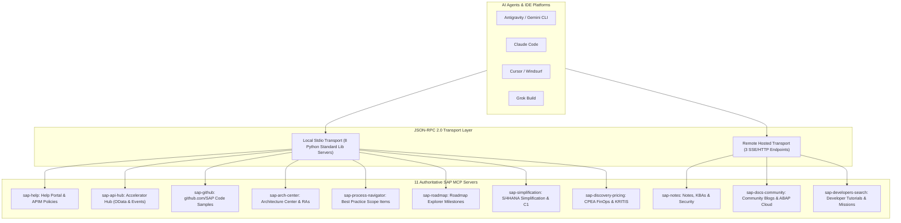

# Enterprise SAP MCP Servers Specification & Catalog

Authoritative technical documentation for all 11 Model Context Protocol (MCP) servers included in the SAP MCP Agent Starter Kit and Enterprise Research Suite.

---

## Architecture Overview

The suite provides a unified Model Context Protocol layer over SAP official ecosystems. Every local server runs over standard JSON-RPC 2.0 via `stdio`, requires zero third-party Python packages (`pip`), and features an offline Single Source of Truth (SSoT) cache with resilient network fallbacks.

---

## Server Summary Matrix

| # | MCP Server Name | Script / Endpoint | Transport | Primary Domain | Target Edition |
|---|-----------------|-------------------|-----------|----------------|----------------|
| 1 | `sap-help` | `scripts/sap_help_mcp_server.py` | stdio | APIM Policies, XML templates, Help Portal | Developer |
| 2 | `sap-api-hub` | `scripts/sap_api_hub_mcp_server.py` | stdio | OData APIs, CloudEvents, Schemas | Developer |
| 3 | `sap-github` | `scripts/sap_github_mcp_server.py` | stdio | Open Source Code (`github.com/SAP`) | Developer |
| 4 | `sap-arch-center` | `scripts/sap_arch_center_mcp_server.py` | stdio | Reference Architectures (RAs), North Star | Architect |
| 5 | `sap-process-navigator` | `scripts/sap_process_navigator_mcp_server.py` | stdio | Scope Items, BPMN flows, business roles | Architect |
| 6 | `sap-roadmap` | `scripts/sap_roadmap_mcp_server.py` | stdio | Release quarters, GA status, sunsets | Enterprise |
| 7 | `sap-simplification` | `scripts/sap_simplification_mcp_server.py` | stdio | Clean Core, Contract C1, obsolete BAPIs | Architect |
| 8 | `sap-discovery-pricing` | `scripts/sap_discovery_pricing_mcp_server.py` | stdio | BTP CPEA FinOps, Hyperscaler KRITIS regions | Enterprise |
| 9 | `sap-notes` | `https://sap-notes-mcp.internal` | SSE/HTTP | SAP Notes, KBAs, Security Advisories | All |
| 10 | `sap-docs-community` | `https://sap-docs-community-mcp.internal` | SSE/HTTP | Community blogs, ABAP Cloud feature matrix | Architect |
| 11 | `sap-developers-search` | `https://developers.sap.com/mcp/search` | SSE/HTTP | Step-by-step developer tutorials, missions | Developer |

---

## Detailed Server Specifications

### 1. `sap-help` (SAP Help Portal & APIM Policies)
* **Executable:** `python3 scripts/sap_help_mcp_server.py`
* **Transport:** `stdio` (JSON-RPC 2.0)
* **Authoritative Source:** [SAP Help Portal - API Management](https://help.sap.com/docs/sap-api-management)
* **Description:** Provides full-text search and retrieval of official SAP APIM Policy XML configurations, Mediation flows, Traffic Management, and Fault Rules.

#### Registered Tools
1. **`sap_help_search`**
   - **Description:** Search SAP Help Portal documentation for APIM policies, security mechanisms, and integration guides.
   - **Parameters:**
     - `query` (string, required): Search term (e.g., `"SpikeArrest"`, `"OAuth"`, `"Integration Cell"`).
2. **`sap_help_get_policy`**
   - **Description:** Retrieve official XML template, configuration parameters, and fault rules for an APIM policy.
   - **Parameters:**
     - `policy_name` (string, required): Name of the APIM policy (e.g., `"SpikeArrest"`, `"Quota"`, `"OAuthV2"`, `"VerifyAPIKey"`, `"AssignMessage"`, `"JSONtoXML"`, `"XMLtoJSON"`, `"JavaScript"`).
3. **`sap_help_list_policies`**
   - **Description:** List all supported APIM policies categorized by policy category (Traffic Management, Security, Mediation, Extension).
   - **Parameters:** None.

---

### 2. `sap-api-hub` (SAP Business Accelerator Hub)
* **Executable:** `python3 scripts/sap_api_hub_mcp_server.py`
* **Transport:** `stdio` (JSON-RPC 2.0)
* **Authoritative Source:** [SAP Business Accelerator Hub](https://api.sap.com)
* **Description:** Discovers and retrieves official SAP OData v2/v4 specifications, CDS entity properties, authentication types, and SAP Event Mesh CloudEvents.

#### Registered Tools
1. **`sap_api_hub_search`**
   - **Description:** Search SAP Business Accelerator Hub for OData APIs and business events.
   - **Parameters:**
     - `query` (string, required): Search term (e.g., `"Business Partner"`, `"Meter Reading"`, `"Billing"`).
2. **`sap_api_hub_get_api`**
   - **Description:** Retrieve technical API specification, entity sets, authentication methods, and rate limits.
   - **Parameters:**
     - `api_name` (string, required): API name or identifier (e.g., `"API_BUSINESS_PARTNER"`, `"API_METER_READING_DOCUMENT"`).
3. **`sap_api_hub_list_events`**
   - **Description:** List all published SAP Event Mesh event types (CloudEvents) across S/4HANA and BTP.
   - **Parameters:** None.

---

### 3. `sap-github` (SAP Open Source & Sample Code)
* **Executable:** `python3 scripts/sap_github_mcp_server.py`
* **Transport:** `stdio` (JSON-RPC 2.0)
* **Authoritative Source:** [SAP GitHub Organizations](https://github.com/SAP) (`github.com/SAP`, `github.com/SAP-samples`)
* **Description:** Indexes and provides production-ready code samples, APIM shared flows, Clean ABAP facades, Cloud SDK Agent implementations, and Event Mesh webhooks.

#### Registered Tools
1. **`sap_github_search_samples`**
   - **Description:** Search official SAP GitHub repositories for production code snippets and architectural blueprints.
   - **Parameters:**
     - `query` (string, required): Search term (e.g., `"oauth shared flow"`, `"clean abap facade"`, `"cloud sdk"`).
2. **`sap_github_get_sample`**
   - **Description:** Retrieve full source code and implementation notes for an architectural pattern.
   - **Parameters:**
     - `sample_id` (string, required): Sample identifier (e.g., `"apim-oauth2-flow"`, `"clean-abap-facade"`, `"cloud-sdk-agent"`, `"event-mesh-webhook"`).
3. **`sap_github_list_reference_repos`**
   - **Description:** List authoritative SAP open-source repositories with scope descriptions.
   - **Parameters:** None.

---

### 4. `sap-arch-center` (SAP Architecture Center & Reference Architectures)
* **Executable:** `python3 scripts/sap_arch_center_mcp_server.py`
* **Transport:** `stdio` (JSON-RPC 2.0)
* **Authoritative Source:** [SAP Architecture Center Portal](https://architecture.sap.com) & [GitHub: SAP/architecture-center](https://github.com/SAP/architecture-center)
* **Description:** Provides authoritative access to SAP Reference Architecture (RA) blueprints, the North Star Architecture (14 chapters), AI Golden Paths, and Autonomous Enterprise standards. Backed directly by the official open-source repository `https://github.com/SAP/architecture-center`.

#### Registered Tools
1. **`sap_arch_search_patterns`**
   - **Description:** Searches SAP Reference Architectures and North Star Architecture chapters for design patterns.
   - **Parameters:**
     - `query` (string, required): Search term (e.g., `"Joule"`, `"Integration Cell"`, `"Clean Core"`, `"Multi-Cloud"`).
2. **`sap_arch_get_ra`**
   - **Description:** Retrieves official SAP Reference Architecture specification with component breakdowns, network topologies, and direct links to the official GitHub source.
   - **Parameters:**
     - `ra_id` (string, required): Identifier (e.g., `"RA0029"`, `"RA0024"`, `"RA0001"`).
3. **`sap_arch_list_ra`**
   - **Description:** Lists all available SAP Reference Architecture blueprints in the catalog.
   - **Parameters:** None.

#### Key Reference Architectures Covered
- **RA0029:** SAP Joule Studio Agent Architecture & GenAI Hub Integration (`docs/ref-arch/RA0029/readme.md`)
- **RA0024:** Hybrid Integration Cell Deployment & Perimeter Security (`docs/ref-arch/RA0024/readme.md`)
- **RA0001:** SAP BTP Multi-Cloud Foundation & Account Model (`docs/ref-arch/RA0001/readme.md`)

---

### 5. `sap-process-navigator` (SAP Best Practice Process Scope Items)
* **Executable:** `python3 scripts/sap_process_navigator_mcp_server.py`
* **Transport:** `stdio` (JSON-RPC 2.0)
* **Authoritative Source:** [SAP Process Navigator / Best Practice Explorer](https://me.sap.com/processnavigator)
* **Description:** Catalogs standard business process scope items, BPMN stage sequences, involved business roles, and transactional outcomes.

#### Registered Tools
1. **`sap_process_search_scope_items`**
   - **Description:** Search SAP Best Practice process scope items by domain, title, or business objective.
   - **Parameters:**
     - `query` (string, required): Search term (e.g., `"meter"`, `"billing"`, `"service"`).
2. **`sap_process_get_scope_item`**
   - **Description:** Retrieve end-to-end BPMN sequence, involved business roles, and business value for a scope item.
   - **Parameters:**
     - `scope_item_id` (string, required): Scope item identifier (e.g., `"2DB"`, `"190"`, `"BD9"`).
3. **`sap_process_list_scope_items`**
   - **Description:** List all available pre-indexed SAP Best Practice scope items.
   - **Parameters:** None.

---

### 6. `sap-roadmap` (SAP Roadmap Explorer & Release Intelligence)
* **Executable:** `python3 scripts/sap_roadmap_mcp_server.py`
* **Transport:** `stdio` (JSON-RPC 2.0)
* **Authoritative Source:** [SAP Roadmap Explorer](https://roadmaps.sap.com)
* **Description:** Validates GA timelines, upcoming platform capabilities, quarterly delivery milestones, and sunset/deprecation warnings across BTP, AI Core, and S/4HANA.

#### Registered Tools
1. **`sap_roadmap_search_innovations`**
   - **Description:** Search SAP Roadmap Explorer for planned, delivered, or updated features.
   - **Parameters:**
     - `query` (string, required): Search term (e.g., `"MCP Server"`, `"Integration Cell"`, `"Joule Studio"`, `"AS4"`).
2. **`sap_roadmap_get_feature_status`**
   - **Description:** Check GA quarter, production readiness status, and deprecation advisories.
   - **Parameters:**
     - `feature_name` (string, required): Feature or service name.
3. **`sap_roadmap_list_innovations`**
   - **Description:** List major platform innovations and delivery quarters.
   - **Parameters:** None.

---

### 7. `sap-simplification` (S/4HANA Simplification Database & Clean Core)
* **Executable:** `python3 scripts/sap_simplification_mcp_server.py`
* **Transport:** `stdio` (JSON-RPC 2.0)
* **Authoritative Source:** [SAP S/4HANA Simplification Item Database](https://me.sap.com/notes) & Clean Core Release Contracts
* **Description:** Identifies deprecated or modified classic ERP objects (BAPIs, tables, transactions) and maps them to SAP Clean Core Contract C1 released APIs and CDS views.

#### Registered Tools
1. **`sap_simplification_check_object`**
   - **Description:** Check if a BAPI, table, or transaction is simplified or deprecated in S/4HANA.
   - **Parameters:**
     - `object_name` (string, required): Name of object (e.g., `"BAPI_METERREADINGDOC_CREATE_MULT"`, `"BAPI_BUPA_CREATE_FROM_DATA"`, `"KNA1"`).
2. **`sap_simplification_get_clean_core_contract`**
   - **Description:** Retrieve Clean Core API release status (Contract C1) and cloud-ready successor.
   - **Parameters:**
     - `object_name` (string, required): Name of object.
3. **`sap_simplification_list_items`**
   - **Description:** List all indexed legacy ERP objects and their Clean Core replacements.
   - **Parameters:** None.

---

### 8. `sap-discovery-pricing` (BTP Discovery Center Pricing & KRITIS Regions)
* **Executable:** `python3 scripts/sap_discovery_pricing_mcp_server.py`
* **Transport:** `stdio` (JSON-RPC 2.0)
* **Authoritative Source:** [SAP Discovery Center](https://discovery-center.cloud.sap)
* **Description:** Calculates monthly BTP CPEA Capacity Units and Euro costs, checks service metrics, and inspects Hyperscaler data centers for KRITIS and BSI C5 compliance.

#### Registered Tools
1. **`sap_discovery_estimate_cost`**
   - **Description:** Estimate monthly BTP CPEA cost in Euros based on usage volume.
   - **Parameters:**
     - `service_name` (string, required): BTP service (e.g., `"SAP Integration Suite"`, `"SAP AI Core"`, `"SAP Event Mesh"`, `"SAP HANA Cloud"`).
     - `metric_quantity` (integer, default: 1): Number of billing units (tenants, model requests, capacity units).
2. **`sap_discovery_check_regions`**
   - **Description:** Inspect data center region availability and compliance (KRITIS, BSI C5).
   - **Parameters:**
     - `service_name` (string, required): BTP service name.
     - `region_filter` (string, optional): Region code (e.g., `"eu10"`, `"eu20"`, `"eu30"`, `"frankfurt"`).
3. **`sap_discovery_list_services`**
   - **Description:** List all billable BTP services and standard metrics in the catalog.
   - **Parameters:** None.

---

### 9. `sap-notes` (SAP Notes & Security Advisories)
* **Transport:** Remote SSE/HTTP (`https://sap-notes-mcp.internal`)
* **Authoritative Source:** [SAP for Me - Notes & KBAs](https://me.sap.com/notes)
* **Description:** Authoritative access to SAP Notes, bugfixes, release dependencies, and critical security patch advisories.

#### Registered Tools
1. **`search`**
   - **Description:** Search SAP Notes and KBAs by keyword or component (e.g., `"BC-CP-IS-APIM"`, `"Security Patch"`).
   - **Parameters:** `query` (string, required).
2. **`fetch`**
   - **Description:** Retrieve full Note content, resolution steps, and prerequisites.
   - **Parameters:** `note_id` (string, required).

---

### 10. `sap-docs-community` (SAP Community & Platform Specs)
* **Transport:** Remote SSE/HTTP (`https://sap-docs-community-mcp.internal`)
* **Authoritative Source:** [SAP Community](https://community.sap.com) & SAP Blogs
* **Description:** Real-world field insights, ABAP Cloud feature matrix cross-referencing, and UI5 version diffing.

#### Registered Tools
1. **`search`**: Search SAP Community blogs and technical discussions.
2. **`fetch`**: Extract clean markdown content from community URLs.
3. **`abap_feature_matrix`**: Cross-reference ABAP Cloud language features by release.
4. **`ui5_version_diff`**: Compare UI5 version releases for breaking changes.

---

### 11. `sap-developers-search` (SAP Developer Center Missions)
* **Transport:** Remote SSE/HTTP (`https://developers.sap.com/mcp/search`)
* **Authoritative Source:** [SAP Developer Center](https://developers.sap.com)
* **Description:** Hands-on developer tutorials, mission slugs, and step-by-step onboarding walkthroughs.

#### Registered Tools
1. **`search_tutorials`**: Search developer tutorials by technology and scenario.
2. **`get_tutorial`**: Retrieve step-by-step exercise instructions.
3. **`list_missions`**: Retrieve curated learning tracks.

---

## Technical Standards & Guardrails

1. **Zero External Dependencies:** All 8 local servers run strictly on Python standard library modules (`json`, `sys`, `os`, `urllib.request`). No `pip install` required.
2. **JSON-RPC 2.0 Compliance:** Every server handles `initialize`, `tools/list`, and `tools/call` according to the Anthropic Model Context Protocol specification (protocol version `2024-11-05`).
3. **Logging Discipline:** All diagnostic and status logs are written strictly to `sys.stderr`. Writing unformatted text to `sys.stdout` violates the JSON-RPC wire protocol and breaks IDE clients.
4. **Data Pruning Guardrail:** Tool outputs return clean, pruned summaries rather than multi-megabyte payloads, protecting AI agent context windows and token expenditure.
