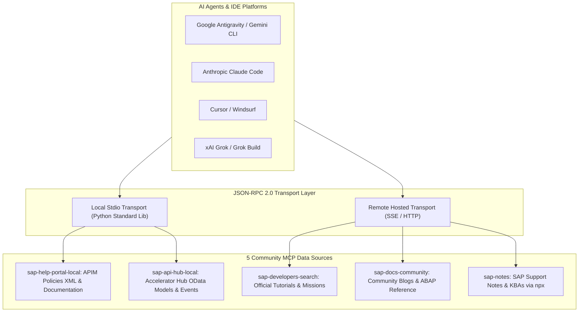

# SAP MCP Community Server Specification & Catalog

Authoritative technical documentation for the Model Context Protocol (MCP) servers included in the **SAP MCP Agent Starter Kit (Community Edition)**.

---

## Architecture Overview

The Community Edition provides a focused Model Context Protocol layer over core SAP developer resources. Local servers run over standard JSON-RPC 2.0 via `stdio` using Python's standard library (zero external `pip` dependencies), paired with official remote community endpoints.



---

## Community Server Summary Matrix

| # | MCP Server Name | Script / Endpoint | Transport | Primary Scope | Tool Count |
|---|-----------------|-------------------|-----------|---------------|:----------:|
| 1 | `sap-help-portal-local` | `scripts/sap_help_mcp_server.py` | Local stdio (Python) | APIM Policy XMLs (`SpikeArrest`, `Quota`, `VerifyAPIKey`), Fault Rules, Help search | 3 |
| 2 | `sap-api-hub-local` | `scripts/sap_api_hub_mcp_server.py` | Local stdio (Python) | S/4HANA OData v2/v4 entity sets, REST endpoints, CloudEvents on Event Mesh | 3 |
| 3 | `sap-developers-search` | `https://developers.sap.com/mcp/search` | Remote HTTP/SSE | Official step-by-step developer tutorials and guided learning missions | 3 |
| 4 | `sap-docs-community` | `https://mcp-sap-docs.marianzeis.de/mcp` | Remote HTTP/SSE | Semantic vector search across SAP Community blogs, ABAP keyword docs | 4 |
| 5 | `sap-notes` | `npx -y sap-note-search-mcp` | Hosted stdio (npx) | Official SAP Notes, KBAs, and release restrictions on `me.sap.com` | 2 |

---

## Detailed Server Specifications

### 1. `sap-help-portal-local` (SAP Help Portal & APIM Policies)
* **Executable:** `python3 scripts/sap_help_mcp_server.py`
* **Transport:** `stdio` (JSON-RPC 2.0)
* **Authoritative Source:** [SAP Help Portal - API Management](https://help.sap.com/docs/sap-api-management)
* **Description:** Provides full-text search and retrieval of official SAP APIM Policy XML configurations, Mediation flows, Traffic Management, and Fault Rules.

#### Registered Tools
1. **`sap_help_search`**
   - **Description:** Search SAP Help Portal documentation for APIM policies, security mechanisms, and integration guides.
   - **Parameters:**
     - `query` (string, required): Search term (e.g., `"SpikeArrest"`, `"OAuth"`, `"Rate Limiting"`).
2. **`sap_help_get_policy`**
   - **Description:** Retrieve official XML template, configuration parameters, and fault rules for an APIM policy.
   - **Parameters:**
     - `policy_name` (string, required): Name of the APIM policy (e.g., `"SpikeArrest"`, `"Quota"`, `"OAuthV2"`, `"VerifyAPIKey"`, `"AssignMessage"`, `"JSONtoXML"`, `"XMLtoJSON"`, `"JavaScript"`).
3. **`sap_help_list_policies`**
   - **Description:** List all supported APIM policies categorized by policy category (Traffic Management, Security, Mediation, Extension).
   - **Parameters:** None.

#### Sample Invocation & Response

**Tool Request (`tools/call`):**
```json
{
  "name": "sap_help_get_policy",
  "arguments": {
    "policy_name": "SpikeArrest"
  }
}
```

**Tool Response (`content[0].text`):**
```xml
<SpikeArrest async="false" continueOnError="false" enabled="true" xmlns="http://www.sap.com/apimgmt">
    <Rate>100pm</Rate>
    <UseEffectiveParam>true</UseEffectiveParam>
</SpikeArrest>
```

---

### 2. `sap-api-hub-local` (SAP Business Accelerator Hub)
* **Executable:** `python3 scripts/sap_api_hub_mcp_server.py`
* **Transport:** `stdio` (JSON-RPC 2.0)
* **Authoritative Source:** [SAP Business Accelerator Hub](https://api.sap.com)
* **Description:** Discovers and retrieves official SAP OData v2/v4 specifications, CDS entity properties, authentication schemes, and SAP Event Mesh CloudEvents.

#### Registered Tools
1. **`sap_api_hub_search`**
   - **Description:** Search SAP Business Accelerator Hub for OData APIs and business events.
   - **Parameters:**
     - `query` (string, required): Search term (e.g., `"Business Partner"`, `"Billing Document"`).
2. **`sap_api_hub_get_api`**
   - **Description:** Retrieve technical API specification, entity sets, authentication methods, and rate limits.
   - **Parameters:**
     - `api_name` (string, required): API identifier (e.g., `"API_BUSINESS_PARTNER"`, `"API_METER_READING_DOCUMENT"`).
3. **`sap_api_hub_list_events`**
   - **Description:** List all published SAP Event Mesh event types (CloudEvents 1.0) across S/4HANA and BTP.
   - **Parameters:** None.

---

### 3. `sap-developers-search` (SAP Developer Center)
* **Transport:** Remote HTTP/SSE (`https://developers.sap.com/mcp/search`)
* **Authoritative Source:** [SAP Developer Center](https://developers.sap.com)
* **Description:** Step-by-step developer tutorials, missions, and hands-on exercises for BTP services and CAP/RAP development.

#### Registered Tools
1. **`search_tutorials`**: Search developer tutorials by technology and scenario.
2. **`get_tutorial`**: Retrieve step-by-step exercise instructions and prerequisite checks.
3. **`list_missions`**: Retrieve curated learning tracks.

---

### 4. `sap-docs-community` (SAP Community & Platform Specs)
* **Transport:** Remote HTTP/SSE (`https://mcp-sap-docs.marianzeis.de/mcp`)
* **Authoritative Source:** [SAP Community](https://community.sap.com) & SAP Blogs
* **Description:** Real-world field insights, ABAP Cloud feature matrix cross-referencing, and UI5 version diffing.

#### Registered Tools
1. **`search`**: Search SAP Community blogs and technical discussions.
2. **`fetch`**: Extract clean markdown content from community URLs.
3. **`abap_feature_matrix`**: Cross-reference ABAP Cloud language features by release.
4. **`ui5_version_diff`**: Compare UI5 version releases for breaking changes.

---

### 5. `sap-notes` (SAP Notes & Security Advisories)
* **Transport:** Hosted stdio (`npx -y sap-note-search-mcp`)
* **Authoritative Source:** [SAP for Me - Notes & KBAs](https://me.sap.com/notes)
* **Description:** Authoritative access to SAP Notes, bugfixes, release dependencies, and critical security patch advisories.

#### Registered Tools
1. **`search`**: Search SAP Notes and KBAs by keyword or component (e.g., `"BC-CP-IS-APIM"`).
2. **`fetch`**: Retrieve full Note content, resolution steps, and prerequisites.

---

## Technical Standards

1. **Zero External Python Dependencies:** Local servers run strictly on Python's built-in standard library (`json`, `sys`, `os`, `urllib.request`).
2. **JSON-RPC 2.0 Compliance:** Standardized `initialize`, `tools/list`, and `tools/call` handshakes.
3. **Clean Protocol Stdio:** Diagnostic logs go to `sys.stderr`, preventing stdout corruption.
