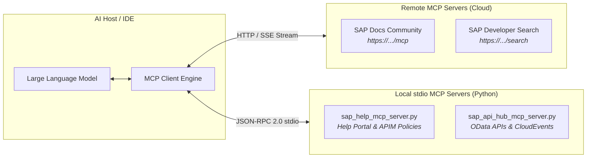
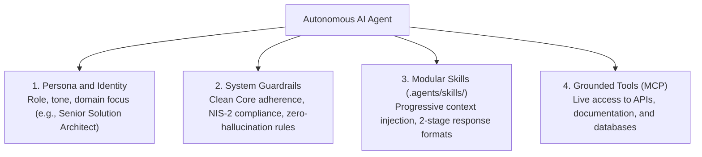

# 📖 What is the Model Context Protocol (MCP)?

> **A Comprehensive Architectural Guide to the Open Standard for AI Agent Tooling**  
> How MCP connects Large Language Models to local tools, enterprise systems, and remote services with zero vendor lock-in.

---

## 🧭 Executive Overview

Large Language Models (LLMs) operate as probabilistic reasoning engines. While possessing broad world knowledge, they are isolated from real-time systems: they cannot directly read local files, execute shell commands, query corporate databases, or interact with enterprise SAP backends.

The **Model Context Protocol (MCP)**, open-sourced by Anthropic and adopted across the AI industry (Google Antigravity, Anthropic Claude Code, Cursor IDE, Windsurf, and xAI Grok Build), serves as an open, vendor-neutral standard—analogous to a **universal USB-C standard for AI connectivity**:



---

## 1. The Two Flavors of MCP Servers

When deploying or consuming MCP servers, you encounter two distinct architectural transports:

### Type A: Remote-Hosted MCP Servers (Pure URLs)
* **Examples:**
  * `sap-docs-community`: `https://mcp-sap-docs.marianzeis.de/mcp`
  * `sap-developers-search`: `https://developers.sap.com/mcp/search`
* **Transport:** Server-Sent Events (SSE) or HTTP streaming over TCP/TLS.
* **How it works:** The MCP server runs on a remote web server. The AI client maintains an open HTTP connection to receive server events and push tool invocation requests.
* **Benefits:** Zero installation, no local Python/Node dependencies, and automatically up-to-date data.
* **Configuration:**
  ```json
  "sap-docs-community": {
    "serverUrl": "https://mcp-sap-docs.marianzeis.de/mcp",
    "description": "Semantic search across SAP community and official documentation."
  }
  ```

### Type B: Local Executable Servers (stdio Subprocesses)
* **Examples:**
  * `sap-help-portal-local`: `scripts/sap_help_mcp_server.py`
  * `sap-api-hub-local`: `scripts/sap_api_hub_mcp_server.py`
  * `sap-notes`: `npx -y sap-note-search-mcp`
* **Transport:** Standard Input (`stdin`) and Standard Output (`stdout`) via local Inter-Process Communication (IPC).
* **How it works:** The AI IDE spawns your script as a child process. Requests arrive line-by-line via `stdin`, and JSON-RPC responses are returned over `stdout`.
* **Benefits:** 100% offline capable (flight mode), zero network latency, and safe access to local files and corporate intranets.
* **Configuration:**
  ```json
  "sap-help-portal-local": {
    "command": "python3",
    "args": ["scripts/sap_help_mcp_server.py"],
    "description": "Local APIM XML policy and Help Portal catalog."
  }
  ```

---

## 2. Deep Dive: Zero-Dependency Python MCP Implementation

While high-level frameworks like `FastMCP` exist, building an MCP server using **pure Python standard library** (`json`, `sys`, `urllib`) reveals how the protocol functions under the hood.

### The JSON-RPC 2.0 Protocol Lifecycle

Every stdio MCP server processes JSON-RPC messages arriving line-by-line over `stdin`:

#### 1. Protocol Handshake (`initialize`)
The client connects and queries protocol compatibility:
```json
// Client -> Server
{"jsonrpc": "2.0", "id": 1, "method": "initialize"}

// Server -> Client
{
  "jsonrpc": "2.0",
  "id": 1,
  "result": {
    "protocolVersion": "2024-11-05",
    "capabilities": {"tools": {}},
    "serverInfo": {"name": "student-sap-help-portal", "version": "1.0.0"}
  }
}
```

#### 2. Exposing Tool Capabilities (`tools/list`)
The client requests available tools along with their strict JSON Schemas:
```json
// Client -> Server
{"jsonrpc": "2.0", "id": 2, "method": "tools/list"}

// Server -> Client
{
  "jsonrpc": "2.0",
  "id": 2,
  "result": {
    "tools": [
      {
        "name": "sap_help_get_policy",
        "description": "Returns official XML configuration template for an APIM policy.",
        "inputSchema": {
          "type": "object",
          "properties": {
            "policy_name": {"type": "string", "description": "e.g. SpikeArrest, Quota, RaiseFault"}
          },
          "required": ["policy_name"]
        }
      }
    ]
  }
}
```

#### 3. Executing Tool Invocations (`tools/call`)
When the model's cognitive planner decides to use a tool, it issues a function call:
```json
// Client -> Server
{
  "jsonrpc": "2.0",
  "id": 3,
  "method": "tools/call",
  "params": {
    "name": "sap_help_get_policy",
    "arguments": {"policy_name": "SpikeArrest"}
  }
}

// Server -> Client
{
  "jsonrpc": "2.0",
  "id": 3,
  "result": {
    "content": [
      {
        "type": "text",
        "text": "## SAP APIM Policy: SpikeArrest\n<SpikeArrest>...Rate: 30ps...</SpikeArrest>"
      }
    ]
  }
}
```

> [!CAUTION]
> **The Cardinal Rule of stdio MCP Servers:**  
> Standard Output (`stdout`) is reserved strictly for valid JSON-RPC responses. Any logging, debugging, or `print()` calls must be redirected to **Standard Error (`stderr`)** via `sys.stderr.write(...)`. Emitting unformatted text to `stdout` corrupts the client's JSON stream.

---

## 3. Defining Autonomous Agents and Skills

A production-grade Enterprise AI Agent combines four distinct layers:



### The Skill Specification Pattern (`SKILL.md`)
Modern AI environments load capabilities dynamically using `SKILL.md` files equipped with YAML frontmatter:

```markdown
---
name: student-copilot
description: >-
  Enterprise Solution Architecture Co-Pilot. Uses MCP tools and provides
  structured 2-stage answers without unverified assertions.
---

# Instructions and Behavior
1. Query MCP tools before proposing technical configurations.
2. Structure recommendations into Executive Summary + Mermaid diagram, followed by Developer, Architect, and Governance perspectives.
```

### Progressive Context Injection
The host environment scans only the YAML metadata (`name` and `description`) at startup. When user queries match the skill description, the full instruction set is injected into the context window on demand—conserving tokens and keeping the model focused.

---

## 🔗 Related Architectural Documents
- 📖 **Protocol Comparison:** [What is an MCP Server vs. a Traditional API?](WHAT_IS_MCP_VS_API.md)
- 🛡️ **Architecture & Legal:** [Why Use MCP Over Web Scraping & Manual Search?](WHY_MCP_OVER_SCRAPING.md)
