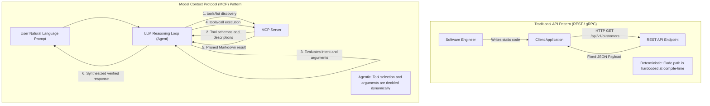

# 🔌 What is an MCP Server? (And How Does It Differ from a Traditional API?)

> **A Foundational Guide for Engineers, Architects, and AI Practitioners**  
> Understanding the paradigm shift from static Application Programming Interfaces (APIs) to dynamic, agentic Model Context Protocols (MCP).

---

## 🧭 Executive Summary

At first glance, a **Model Context Protocol (MCP)** server might look like "just another API." After all, both accept parameters, perform computation, and return data.

However, MCP represents a fundamental shift in software architecture:
* **Traditional APIs (REST, GraphQL, gRPC)** are designed for **deterministic human programmers** who write fixed code at compile-time.
* **MCP Servers** are designed for **probabilistic AI reasoning engines (LLMs)** that discover, evaluate, and invoke tools dynamically at runtime based on natural language intent.



---

## ⚖️ Key Architectural Differences

### 1. The Consumer: Deterministic Code vs. Probabilistic Reasoning
* **REST API:** Consumed by explicit program logic. If a developer needs customer data, they hardcode `fetch('https://api.example.com/customers?id=42')`. The API contract assumes the caller knows exactly what endpoint to call and when.
* **MCP Server:** Consumed by an autonomous Large Language Model. The LLM reads the user's natural language goal (*"Find out why customer 42 cannot log in"*), inspects the registered tools, deduces that `sap_api_hub_get_api` or `check_user_status` is relevant, constructs the arguments, and executes the call.

### 2. Self-Describing Semantic Contracts (Prompt-Driven Schemas)
In a REST API, OpenAPI/Swagger descriptions are primarily documentation for human engineers. In an MCP server, descriptions are **functional prompt tokens**:
```json
{
  "name": "sap_help_get_policy",
  "description": "Retrieves official specification and XML template for an APIM policy. Use this tool whenever the user asks for rate limiting, traffic shaping, SpikeArrest, or Quota rules.",
  "inputSchema": {
    "type": "object",
    "properties": {
      "policy_name": {
        "type": "string",
        "description": "The exact name of the policy, e.g. SpikeArrest, Quota, or RaiseFault."
      }
    },
    "required": ["policy_name"]
  }
}
```
If you change the wording in the `description` field of an MCP tool, you directly influence the **LLM's probability of selecting that tool**. The schema is not merely a type validator—it is an instruction set for the model's cognitive planner.

### 3. Transport & Process Architecture: stdio vs. Network Sockets
* **APIs:** Almost exclusively operate over network sockets via HTTP/1.1, HTTP/2, or HTTP/3 (TCP/TLS). They require DNS resolution, port management, firewall rules, and SSL certificates.
* **MCP Servers:** Support **transport decoupling**. A local MCP server runs as a child process of the AI client communicating over **standard input and output (`stdio`)**.
  * **Zero network latency:** IPC (inter-process communication) over Unix pipes or Windows standard streams.
  * **Zero attack surface:** No open listening ports, no firewall traversal, immune to external network scanning.
  * **Seamless remote migration:** When remote access is needed, the exact same protocol runs over HTTP with **Server-Sent Events (SSE)**.

### 4. Protocol Primitive: Beyond Simple Requests
Traditional REST is request-response over stateless HTTP. MCP standardizes four distinct primitives tailored for AI collaboration:
1. **Tools:** Executable functions that allow the model to take actions (e.g., query a database, deploy an iFlow, run tests).
2. **Resources:** Read-only data streams that can be attached to context (e.g., log files, schemas, Git diffs).
3. **Prompts:** Reusable, parameterized prompt templates provided directly by the server to guide user interactions.
4. **Sampling (Agent Callback):** An MCP server can ask the AI client to perform reasoning or run an LLM completion on its behalf.

---

## 📊 Comprehensive Feature Matrix

| Capability | REST API | GraphQL | gRPC / RPC | Model Context Protocol (MCP) |
| :--- | :--- | :--- | :--- | :--- |
| **Primary Caller** | Web / Mobile Apps | Frontend Apps | Microservices | **AI Agents & LLMs** |
| **Call Decision** | Hardcoded by dev | Hardcoded by dev | Hardcoded by dev | **Autonomous (Model Reasoning)** |
| **Interface Contract** | OpenAPI / Swagger | GraphQL Schema | Protocol Buffers (`.proto`) | **JSON Schema + Semantic Prompts** |
| **Transports** | HTTP / REST | HTTP POST | HTTP/2 binary | **stdio pipes & HTTP / SSE** |
| **Network Requirement** | Requires open ports | Requires open ports | Requires open ports | **Works 100% offline via stdio** |
| **Data Optimization** | Over/under-fetching | Client-specified query | Compact binary | **Token-Pruned Markdown / Text** |
| **Standardization Body** | W3C / OpenAPI | GraphQL Foundation | CNCF / Google | **Anthropic Open Standard** |

---

## 💡 Practical Example: Converting a REST API to an MCP Tool

Consider a typical internal SAP API:
`GET https://internal-gateway.corp/sap/c4c/api/v1/tickets?id=123`

To expose this to an AI Agent via MCP:
1. **Wrap the call** in a Python function inside your local MCP server.
2. **Define the semantic schema:** Explain to the model *when* and *why* this tool should be used.
3. **Prune the response:** Instead of returning a 400-line JSON object with internal database IDs and SAP GUIDs, strip it down to the essentials (Ticket Title, Status, Priority, Description) before passing it to `stdout`.

**Result:** The AI assistant can now diagnose customer tickets, compare them against SAP Help guidelines, and draft solutions—accurately, securely, and within token budget.
