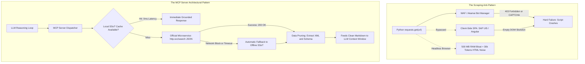

# 🛡️ Why MCP Over Web Scraping & Manual Search?

> **An Architectural & Legal Analysis for Enterprise AI Systems**  
> Why relying on traditional web scraping or manual search destroys reliability, violates compliance, and wastes tokens—and how the Model Context Protocol (MCP) solves it.

---

## 🧭 Executive Summary

When developers first build AI assistants, they often ask:  
*"Why do I need an MCP server to search SAP Help Portal or API documentation? Can't my agent just scrape the website or use a web search tool?"*

In enterprise and mission-critical environments (such as energy utilities, KRITIS, and financial services), web scraping is a fragile anti-pattern. An MCP server transforms raw data into **grounded, deterministic context** while avoiding bot bans, client-side rendering failures, and token depletion.



---

## 🔍 Technical Deep Dive: Why Web Scraping Fails in the Real World

### 1. The Single Page Application (SPA) Hydration Trap
Modern enterprise portals (including `help.sap.com`) do not serve static HTML documents. They serve minimal JavaScript loader shells (SAP UI5, Angular, or React):
```html
<!-- What a simple python requests.get() actually receives: -->
<!DOCTYPE html>
<html>
  <head><title>SAP Help Portal</title></head>
  <body>
    <div id="root"></div>
    <script src="/bundles/main.js"></script>
  </body>
</html>
```
The actual documentation content **does not exist in the DOM** until JavaScript runs. 
* To scrape this, you would need headless browsers (Playwright, Puppeteer, Selenium).
* **Consequence:** 500 MB RAM per worker process, 3- to 8-second startup latencies, and high resource costs that choke automated CI/CD pipelines.

### 2. Web Application Firewalls (WAF) & Bot Mitigation
Enterprise websites are protected by advanced bot mitigation solutions (e.g., Akamai Bot Manager, Cloudflare, Imperva).
* Naive scraping scripts lacking genuine browser fingerprinting trigger TLS fingerprint mismatch, missing canvas/WebGL challenges, and request rate heuristics.
* **Consequence:** Immediate `403 Forbidden`, Cloudflare Turnstile CAPTCHAs, or IP subnet rate-limiting.

### 3. Context Window Pollution & Token Economy
When a web scraping tool dumps a rendered web page into an LLM context:
* The model receives headers, navigation bars, cookie banners, tracking scripts, footers, and related articles—easily **15,000 to 40,000 tokens** of pure noise.
* **Consequence:** High inference costs, slow response times, and model attention degradation ("lost in the middle").

---

## 🏛️ The Three Perspectives: Why MCP Wins

### 💻 1. Developer Perspective: Precision, Data Pruning & Zero Friction
* **Direct Microservice Communication:**  
  Our didactic MCP server bypasses the HTML frontend completely. It communicates directly with the machine-readable backend JSON search endpoint (`https://help.sap.com/http.svc/search`), parsing structured fields in milliseconds.
* **Deterministic Data Pruning:**  
  The MCP server extracts only the exact XML schema, parameters, and HTTP fault codes (e.g., `SpikeArrestViolation`, HTTP `429`). Instead of 30,000 tokens of noisy HTML, it sends **200 tokens of pristine markdown** to the model.
* **Zero Context Switching:**  
  Developers remain entirely within their IDE. No jumping between browser tabs, no manual copy-pasting, and no outdated Apigee or Neo documentation polluting the prompt.

### 🏛️ 2. Solution Architect Perspective: Resilience, SSoT & IP Protection
* **Air-Gapped & Offline Resilience (Flight-Mode Ready):**  
  Enterprise architects often work inside secure customer DMZs, high-security utility networks (KRITIS), or while traveling. An MCP server incorporates an offline **Single Source of Truth (SSoT)**. If network connectivity fails, the agent falls back instantly to curated local specifications without throwing an error.
* **Protecting Corporate IP Reputation:**  
  If 50 developers in a corporate office run automated scraping scripts, Akamai flags the entire corporate egress IP address. As a result, every human employee in the building gets blocked by CAPTCHAs on official partner portals. The MCP server eliminates this risk by leveraging caching, rate throttling, and authenticated APIs.
* **Stable Interface Contracts:**  
  HTML structures change with every portal redesign, silently breaking scrapers. The MCP interface contract (`TOOLS` schema) remains stable, ensuring backward-compatible agent automation.

### 👔 3. C-Level & Legal Perspective: Compliance, FinOps & Audit Trails
* **Legal Compliance & Terms of Service (ToS):**  
  Almost all enterprise service portals explicitly prohibit automated web scraping in their Terms of Service. Violating ToS risks legal cease-and-desist notices and partner account revocations. Using MCP servers accessing authorized API endpoints ensures full legal compliance.
* **Token FinOps (Cost Control):**  
  A reduction from 25,000 tokens to 250 tokens per query represents a **99% reduction in LLM inference costs**. At scale (e.g., 5,000 developer queries across an engineering department), this saves thousands of dollars in monthly API consumption.
* **Auditability & EU AI Act (Art. 12 Record-Keeping):**  
  When an AI agent designs an infrastructure or API security policy, enterprise governance requires traceability. An MCP server produces a deterministic audit trail:
  ```json
  {"tool_call": "sap_help_get_policy", "parameters": {"policy_name": "SpikeArrest"}, "source": "help.sap.com", "timestamp": "2026-09-21T08:50:00Z"}
  ```
  Scraped text pasted manually into a chat window cannot be audited or verified for regulatory compliance.

---

## 📊 Summary Comparison

| Dimension | Web Scraping / Manual Search | Dedicated MCP Server |
| :--- | :--- | :--- |
| **Data Format** | Unstructured HTML / CSS noise (30k tokens) | Pruned, structured Markdown & JSON (200 tokens) |
| **Client-Side SPAs** | Fails or requires heavy headless Chromium | Directly queries structured backend endpoints |
| **Reliability** | Breaks on portal redesigns or WAF triggers | Contract-based schemas with offline SSoT fallback |
| **Network Impact** | Risks corporate IP bans via bot-detection | Zero-traffic local cache; compliant rate-limiting |
| **Legal Compliance** | Often violates portal Terms of Service | Fully compliant with official APIs & local data |
| **Offline Capability** | ❌ 0% (Fails without internet) | ✅ 100% (Instant fallback to offline knowledge) |
| **Inference Latency** | 5,000–12,000 ms | 100–300 ms |
